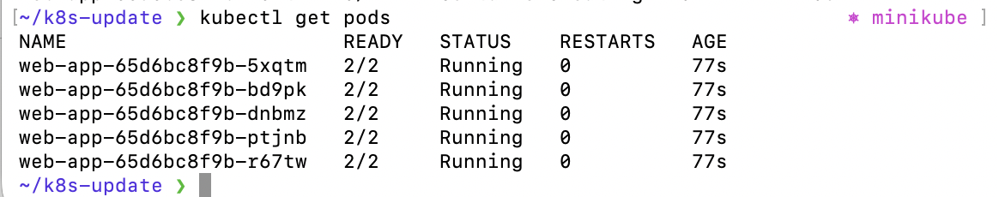
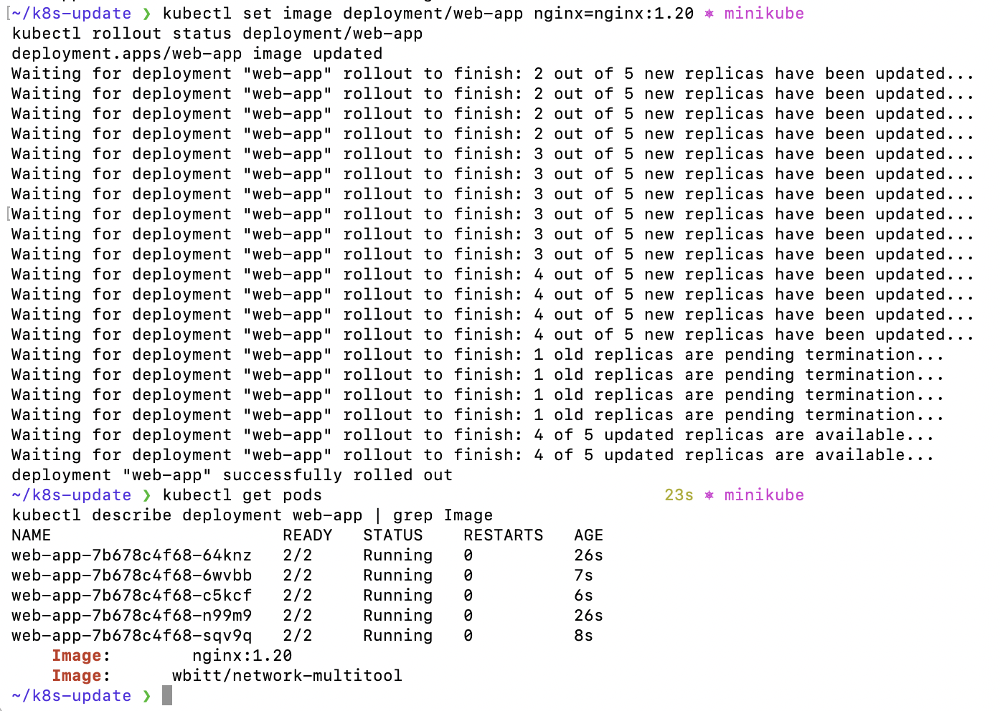
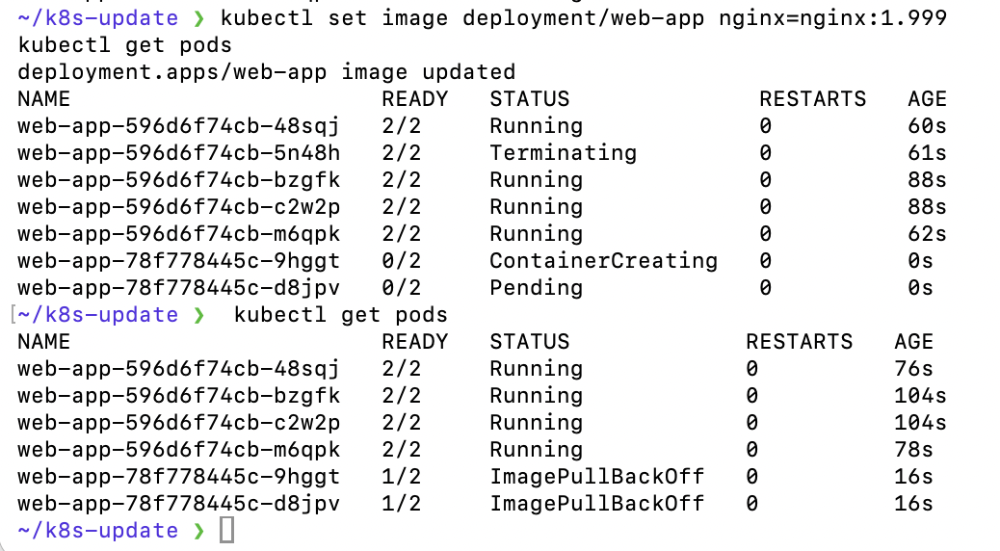
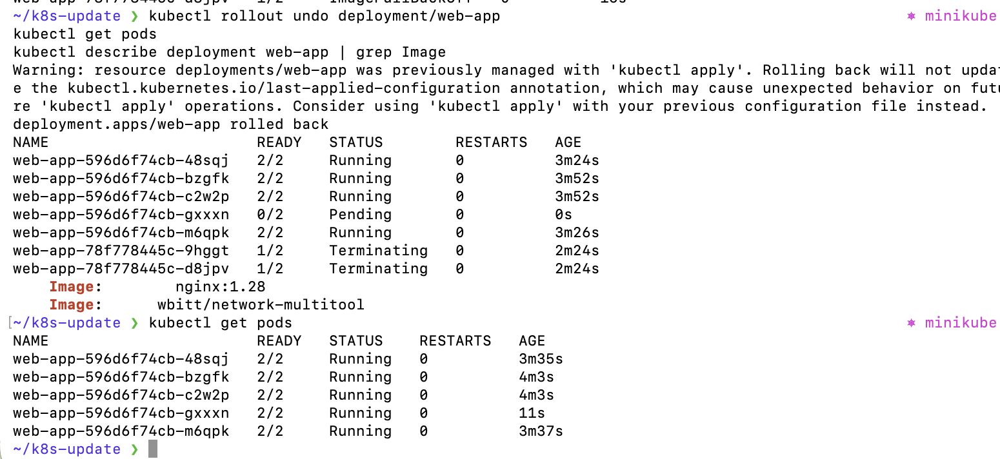

# Домашнее задание к занятию «Обновление приложений» САВКИН ИН

---

## Задание 1. Выбор стратегии обновления

**Условия:**
- Ресурсы ограничены, увеличить нельзя
- Запас ресурсов 20%
- Мажорное обновление — старые и новые версии **несовместимы**

**Выбор: стратегия Recreate**

**Обоснование:**

Rolling Update держит одновременно старые и новые поды в процессе обновления. При мажорном обновлении с несовместимостью версий это критично — старые и новые поды будут работать параллельно и могут сломать данные или API друг другу.

Recreate сначала удаляет **все** старые поды, затем создаёт новые. Это гарантирует что несовместимые версии никогда не работают одновременно.

Запас в 20% не позволяет использовать Rolling Update — он требует дополнительные ресурсы на время обновления (минимум +1 под). Recreate не требует дополнительных ресурсов.

**Минус:** кратковременный downtime при обновлении. При несовместимых версиях это приемлемая цена за целостность данных.

---

## Задание 2. Обновление приложения

### Манифест Deployment (deployment.yaml)

```yaml
apiVersion: apps/v1
kind: Deployment
metadata:
  name: web-app
spec:
  replicas: 5
  selector:
    matchLabels:
      app: web-app
  strategy:
    type: RollingUpdate
    rollingUpdate:
      maxSurge: 1
      maxUnavailable: 1
  template:
    metadata:
      labels:
        app: web-app
    spec:
      containers:
      - name: nginx
        image: nginx:1.19
        ports:
        - containerPort: 80
      - name: multitool
        image: wbitt/network-multitool
        env:
        - name: HTTP_PORT
          value: "8080"
        ports:
        - containerPort: 8080
```

### Шаг 1 — Начальное состояние (nginx:1.19, 5 реплик)

```bash
kubectl apply -f deployment.yaml
kubectl get pods
```



### Шаг 2 — Обновление до nginx:1.20

Для минимального времени обновления используем `maxSurge: 1` и `maxUnavailable: 1` — это позволяет обновлять по 1 поду за раз при минимальном downtime.

```bash
kubectl set image deployment/web-app nginx=nginx:1.20
kubectl rollout status deployment/web-app
kubectl get pods
kubectl describe deployment web-app | grep Image
```



### Шаг 3 — Попытка обновления до несуществующей версии nginx:1.999

```bash
kubectl set image deployment/web-app nginx=nginx:1.999
kubectl get pods
```

Поды с новой версией зависают в `ImagePullBackOff`, старые поды продолжают работать — приложение доступно.



### Шаг 4 — Откат после неудачного обновления

```bash
kubectl rollout undo deployment/web-app
kubectl get pods
kubectl describe deployment web-app | grep Image
```



Откат прошёл успешно — вернулась предыдущая рабочая версия nginx:1.28, все 5 подов в статусе Running.
